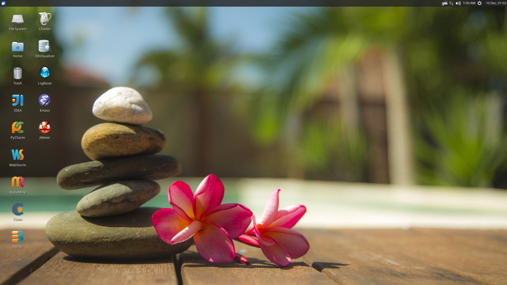

# Overview
This project is a Vagrant box that is provisioned for JVM monitoring.  It is a Xubuntu-based system and 
has many of the tools needed by operations already installed.  The provisioning mechanism is based on Ansible 
and allows for user-specific customizations to be applied.

# Prerequisites

* [Vagrant](https://www.vagrantup.com/) installed and working
* [VirtualBox](https://www.virtualbox.org/) installed and working
* [VirtualBox Extension Pack](https://www.virtualbox.org/wiki/Downloads) installed into VirtualBox 
* **[Virtualization support](https://en.wikipedia.org/wiki/X86_virtualization) enabled in your BIOS**
* a working internet connection
* Your corporate VPN running (if you want to apply some work-specific plays) 

# Building
All the components of the environment live in repositories on the internet so there is nothing to build.

# Installation
Use Git to clone this project, go into the project folder and type `vagrant up` and go get a cup of coffee.  The construction time 
of the box greatly depends on your internet speeds.

# Tips and Tricks

## RAM and CPU Settings
If you examine the `vagrantfile` file, you will see that the virtual machine is configured to use 6GB of RAM and
2 CPUs.  Feel free to change these values to match your computer's hardware.

## Low Disk Space
If an environment is used long enough, it is likely to run out of disk space.  The two main culprits are kernal updates 
filling up the `/boot` partition and Docker images filling up the `/opt/docker` partition.  You have at least 3 options:

* throw away the environment and start fresh
* clean up the old kernels via `sudo apt-get autoremove`
* clean up Docker containers via `docker rm --volumes --force $(docker ps --all --quiet)`
* clean up Docker images, after cleaning up the containers, via `docker rmi --force $(docker images --quiet)`
 
## Verifying The Setup
Log into the system with a username of `vagrant` and password of `vagrant`.

## Installed Infrastructure

## Applying Your Work Specific Customizations

## Applying Your Own Customizations

## Installed Software

* current [JDK](http://www.oracle.com/technetwork/java/index.html)

# Troubleshooting

## Vagrant Box Does Not Come Up
If you find that when you are building a new box that it does not come up, try going into the `Settings->USB` section of your box 
in the VirtuabBox UI and disabling the USB controller. If you want USB support, make sure you have installed 
[VM VirtualBox Extension Pack](https://www.virtualbox.org/wiki/Downloads).

You should also double check that you have **enabled virtualization support** in your BIOS.

## Partial Failure
Sometimes networks fail or mirror sites go down. If you experience a failure, you can attempt to resume the construction 
by issuing `vagrant provision` at the command line.  Vagrant will attempt to start over, but will skip any provisions that
have already taken place. 

# License and Credits
This project is licensed under the [Apache License Version 2.0, January 2004](http://www.apache.org/licenses/).

